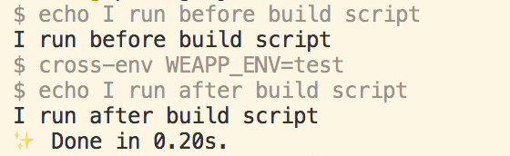

> 运用好npm脚本命令可以帮助快速按需启动程序。
## 简介：
npm run命令可以执行package.json文件里scripts字段里定义的脚本命令。当执行npm run的时候，会自动创建一个Shell，这个Shell会将当前目录的`node_modules/.bin`子目录绝对路径加入PATH环境变量中，执行结束后，再将PATH变量恢复原样。`node_modules/.bin`目录下的脚本全部为可执行文件，所以在定义脚本命令的时候，可以直接调用该目录下的脚本名，不必加上路径。比如当前项目依赖cross-env，可以直接执行该命令：
<!-- more -->
```js
  {
    "scripts": {
      "build": "cross-env NODE_ENV=test"
    }
  }
```
npm脚本就是Shell脚本，所以只要是Shell中可以执行的脚本，都可以写在scripts命令中。

## 传参
向npm传入参数，需要使用`--`说明符：
```js
  npm run build --config webpack1.config.js
```
说明：`config`为参数名，`webpack1.config.js`为参数值，这条命令的意思是执行build命令的时候读取`webpack1.config.js`文件配置（默认是使用名为`webpack.config.js`的配置）

## 执行顺序
如果npm中一个命令需要执行多个任务，需要明确它们的执行顺序。
如果是并行执行（即同时执行多个任务），可以使用`&`符号。
```js
  "scripts": {
      "test": "install & build"
    }
```

如果是继发执行（即前一个任务执行完成之后，才开始执行下一个任务），可以使用`&&`符号。
```js
  "scripts": {
      "test": "build && upload"
    }
```

以上方法同样适用于多个命令。
```js
  npm run script1 & npm run script2
  npm run script1 && npm run script2
```

## 钩子
npm有`pre`和`host`两个钩子，一个是某个命令之前执行，一个是之后执行，比如build命令的钩子是prebuild和postbuild。
```js
  "scripts": {
      "prebuild": "echo I run before build script",
      "build": "cross-env NODE_ENV=prod",
      "postbuild": "echo I run after build script"
    }
```
以上命令，当我们输入`npm run build`的时候，控制台会先打印“I run before build script”，接着执行`cross-env NODE_ENV=prod`命令，然后打印“I run after build script”。


**注意：** 测试发现双重post不生效，比如postpostbuild，但是双重pre可以生效，比如preprebuild，不过尽量还是不要定义以pre和post开头的命令。

## 环境变量
npm会设置很多环境变量，可以通过`npm run env`查看，其中package.json中设置的字段，都会被自动添加上npm_package_的前缀，比如scripts里的build字段就会被编译成`npm_package_scripts_build`。npm的所有环境变量可以通过`npm run env`来查看。

**注意：**
* 可以在命令语句中定义变量，形式是“名称=值”，比如执行语句中加入“NODE_ENV=true”会成为环境变量，“MOCK=true”也是环境变量，都可以通过process.env来获取；
* 如果命令上有“:”，也会被替换成“_”；
* 如果对象的值是数组，则编译之后是按下标作为key。比如`{"pretest": ["a","b"]}`会被编译成`"npm_package_pretest_0": "a",`和`"npm_package_pretest_1": "b"`；
* `npm_lifecycle_event`字段用于标识当前处于哪一个阶段（所谓的生命周期），比如执行prebuild的时候，`npm_lifecycle_event`的值为prebuild，我们可以通过`process.env.npm_lifecycle_event`取值。

## 进阶：commander
有时候我们不希望在scripts中定义很多命令，但是又希望可以根据需求执行不同的脚本，这个时候可以在同一个命令中传入不同的参数来区分执行什么操作。我们可以通过process.argv获取启动node.js进程时传入的命令行参数，然后通过js语法判断传入的参数值，最后执行相应的操作。
（注意：当我们启动node.js进程的时候，process.argv获取第一个参数其实是node的安装路径，第二个参数是执行文件的所在路径，从第三个参数开始才是我们实际希望传入的参数。）
这里提供一个快速取出参数的方法，利用commander插件。
第一步：安装。`npm i commander --save`；
第二步：引入。在node启动的程序文件中进入，`const program = require('commander')`;
第三步：使用。`program.option('-u, --upload').parse(process.argv)`;
第四步：判断参数。`if(program.upload) { upload(); }`
然后当我们执行`node index.js -u`的时候，就会使`program.upload`为true，从而执行if里面的函数。
- 更多使用方法请参数：https://www.npmjs.com/package/commander**


## 参考文档：
* http://www.ruanyifeng.com/blog/2016/10/npm_scripts.html
* https://juejin.im/post/5cb3f1ef5188256d917874ff
* https://www.npmjs.com/package/commander