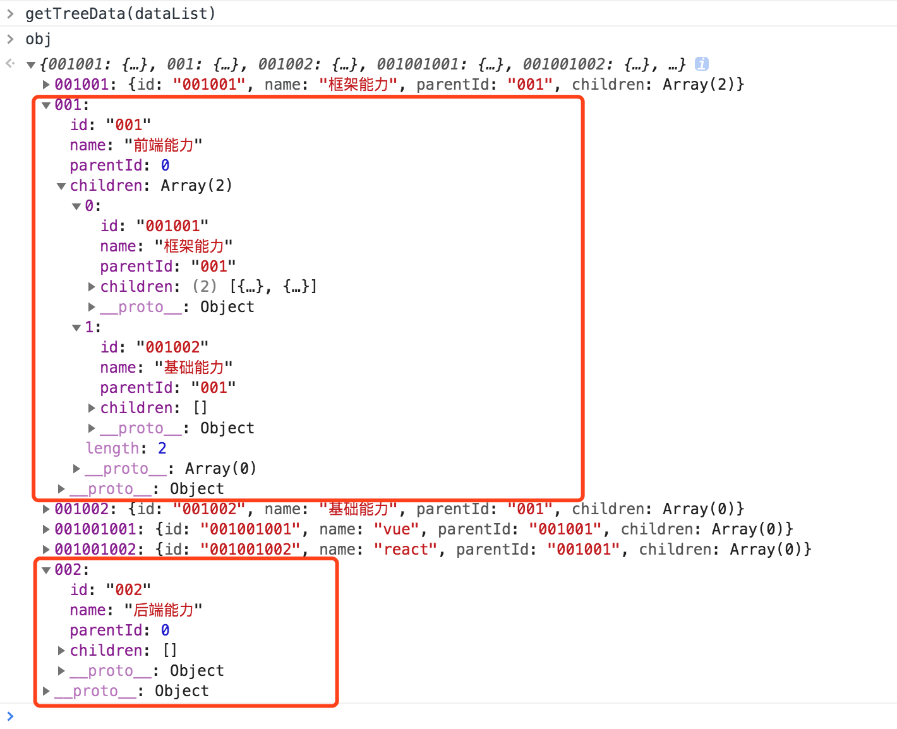
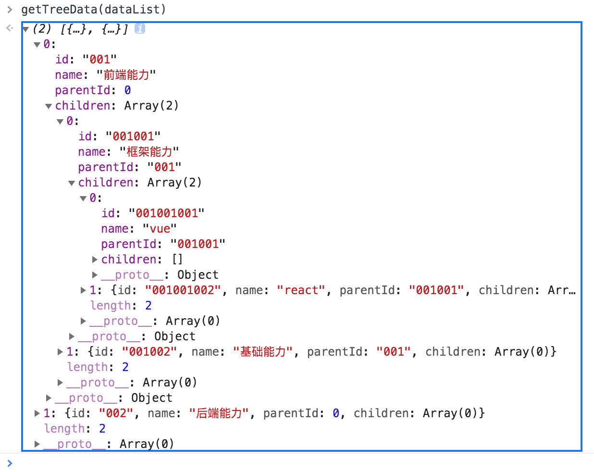

将有层级关系的偏平数据结构转换成能够显示层级关系的树状结构，比较常见的比如目录树。

有下面这样的数据：
<!-- more -->
```js
const dataList = [
  {
    id: '001001',
    name: '框架能力',
    parentId: '001'
  },
  {
    id: '001',
    name: '前端能力',
    parentId: 0
  },
  {
    id: '001002',
    name: '基础能力',
    parentId: '001'
  },
  {
    id: '001001001',
    name: 'vue',
    parentId: '001001'
  },
  {
    id: '001001002',
    name: 'react',
    parentId: '001001'
  },
  {
    id: '002',
    name: '后端能力',
    parentId: 0
  }
]
```

我们希望转变成下面这样的树状结构：
```js
[
  {
    id: '001',
    name: '前端能力',
    parentId: 0,
    children: [
      {
        id: '001001',
        name: '框架能力',
        parentId: '001',
        children: [
          {
            id: '001001001',
            name: 'vue',
            parentId: '001001',
            children: []
          },
          {
            id: '001001002',
            name: 'react',
            parentId: '001001',
            children: []
          }
        ]
      },
      {
        id: '001002',
        name: '基础能力',
        parentId: '001',
        children: []
      }
    ]
  },
  {
    id: '002',
    name: '后端能力',
    parentId: 0
  }
]
```

## 方法一：对象取值法
```js
function getTreeData(dataList) {
  let obj = {};
  dataList.forEach((item) => {
    item['children'] = [];
    obj[item.id] = item;
  });

  const treeData = [];
  dataList.forEach((item) => {
    if (item.parentId) {
      obj[item.parentId].children.push(item);
    } else {
      treeData.push(item);
    }
  });
  return treeData;
}
```
解析：
第一步：第一个for循环，将原始数组转换成对象保存，id作为对象的key，每一个数组item最为value；由于树状结构中需要存放children属性，所以需要在每一项item上添加一个children属性，值为一个空数组；
第二步：创建一个treeData空数组，用来存放最终生成的数据；
第三步：再次进行for循环，如果当前节点存在父级节点，则将子节点push到父节点的children属性中；如果当前节点没有父节点，说明该节点是根节点，直接push到treeData中。巧妙之处：由于obj对象中属性的value值与dataList的各个item都是引用类型，且它们都指向同一个堆内存地址，所以当obj中的对象值发生改变的时候，item也会产生相同的变化（obj中的对象和item都是从同一个堆内存里面取值）。而treeData数组中的值也和item指向同一个内存地址，所以最终当我们返treeData的时候，能够得到我们希望的数据结构。


第四步：由于我们只往treeData中push了根节点对象，所以最终返回了我们期望的数据结构。

## 方法二：递归法
```js
function getTreeData(dataList) {
  function getChildren(id) {
    let treeData = [];
    dataList
    .filter((item) => {
      return item.parentId === id;
    })
    .forEach((item) => {
      item['children'] = getChildren(item.id);  // 递归调用
      treeData.push(item);
    });
    return treeData;
  }
  return getChildren(0);  // 这里输入的参数是根节点的父节点，根据实际情况传值
}
```
解析：
第一步：将父节点的根节点作为参数传给getChildren函数；
第二步：getChildren函数会将原始数据中parentId和传入参数值一致的对象节点过滤出来（第一次过滤出来的其实都是根节点）；
第三步：遍历过滤出来的节点，并给他们一个children属性，children的结构和父结构完全一致，我们递归调用getChildren函数，然后将每一个节点push到treeData这个空数组中；
第四步：返回treeData数组。



