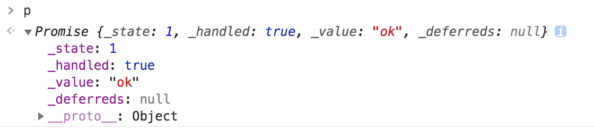

本文是对promise-polyfill源码的学习理解，源码下载地址：https://github.com/taylorhakes/promise-polyfill

## 实现promise主要为五个部分：
1、doResolve函数：用来执行实例化Promise时传入的函数参数；例如：new Promise(fn)，fn函数会在doResolve中执行；
2、resolve函数：改变实例化Promise对象的初始状态，并获取实例返回的resolve的值；
3、finale函数：遍历promise对象_deferreds数组里的每一个Promise实例并对她们进行处理（利用handle函数）。
4、then函数：处理 .then 函数（利用handle函数），并返回一个新的promise对象；
5、handle函数：执行then函数里传入的两个参数（resolve，reject），并将状态未发生改变（还没有执行过）的promise对象存入_deferreds数组中，并通过第二步中的resolve函数改变then函数返回的新的promise的状态。
<!-- more -->

## Promise初始化包含的属性：
1、_state：promise的执行状态，0-pending，1-resolved，2-rejected，3-promise实例；
2、_handled：用来表示当前promise实例是否被处理过；
3、_value：表示执行resolve或reject函数传入的值；
4、_deferreds：用来存放新的promise；

## 举例分析：
```js
const p = new Promise((res, rej) => { res('ok'); });
p.then((resolve) => { console.log(resolve); })
```

## 源码解析：
* Promise构造函数：
```js
function Promise(fn) {
  if (!(this instanceof Promise))
    throw new TypeError('Promises must be constructed via new');
  if (typeof fn !== 'function') throw new TypeError('not a function');
  /** @type {!number} */
  this._state = 0;
  /** @type {!boolean} */
  this._handled = false;
  /** @type {Promise|undefined} */
  this._value = undefined;
  /** @type {!Array<!Function>} */
  this._deferreds = [];

  doResolve(fn, this);
}
```
初始化Promise中的属性。

* doResolve函数：
```js
function doResolve(fn, self) {
  var done = false;
  try {
    fn(
      function(value) {
        if (done) return; // 为了避免多次执行resolve函数
        done = true;
        resolve(self, value);
      },
      function(reason) {
        if (done) return; // 为了避免多次执行reject函数
        done = true;
        reject(self, reason);
      }
    );
  } catch (ex) {
    if (done) return;
    done = true;
    reject(self, ex);
  }
}
```
这里执行的fn就是我们实例化Promise时传入的函数，即(res, rej) => {res('ok');}。此时当我们执行res函数的时候，就会执行fn函数里的第一个参数，此时会执行resolve函数。

* resolve函数
```js
function resolve(self, newValue) {
  try {
    ...
    self._state = 1;
    self._value = newValue;
    finale(self);
  } catch (e) {
    reject(self, e);
  }
}
```
resolve函数会改变当前实例的_state状态，并将传入的值“ok”赋给当前实例，接下来去finale函数中遍历当前实例上的其他promise实例并执行。

* promise实例
```js
function finale(self) {
  if (self._state === 2 && self._deferreds.length === 0) {
    Promise._immediateFn(function() {
      if (!self._handled) {
        Promise._unhandledRejectionFn(self._value);
      }
    });
  }

  for (var i = 0, len = self._deferreds.length; i < len; i++) {
    handle(self, self._deferreds[i]);
  }
  self._deferreds = null;
}
```
此时_deferreds上并没有值，Promise实例化完毕，生成一个promise对象。



# .then()方法的实现
```js
Promise.prototype.then = function(onFulfilled, onRejected) {
  // @ts-ignore
  var prom = new this.constructor(noop);
  handle(this, new Handler(onFulfilled, onRejected, prom));
  return prom;
};

function Handler(onFulfilled, onRejected, promise) {
  this.onFulfilled = typeof onFulfilled === 'function' ? onFulfilled : null;
  this.onRejected = typeof onRejected === 'function' ? onRejected : null;
  this.promise = promise;
}
```
noop是一个空函数`function noop() {}`，这里只是为了生成一个新的promise对象，最终返回这个新的promise对象。注意，“this”此时指向的是对象p，onFulfilled和onRejected是我们调用then时传入的函数。

* handle函数
```js
function handle(self, deferred) {
  while (self._state === 3) {
    self = self._value;
  }
  if (self._state === 0) {
    self._deferreds.push(deferred);
    return;
  }
  self._handled = true;
  // 这里的_immediateFn是借助setTimeout函数实现异步操作，属于宏认为，实际浏览器中的promise是通过微任务实现异步处理的
  Promise._immediateFn(function() {
    var cb = self._state === 1 ? deferred.onFulfilled : deferred.onRejected;
    if (cb === null) {
      (self._state === 1 ? resolve : reject)(deferred.promise, self._value);
      return;
    }
    var ret;
    try {
      ret = cb(self._value);
    } catch (e) {
      reject(deferred.promise, e);
      return;
    }
    resolve(deferred.promise, ret);
  });
}
```
当所有的同步代码执行完毕后，Promise._immediateFn函数里的内容才会开始执行。此时self指向p对象，所以cb的值会是`cp = deferred.onFulfilled`，即then时传入的第一个参数`(resolve) => { console.log(resolve); }`。因为self._value的值是“ok”，所以浏览器会通过console.log打印出“ok”。接下来刚刚生成的新的promise会被带入resolve函数中继续执行，步骤同上。

> tips：结合断点调试分析，理解效果更佳。

## 参考文献
1. https://juejin.im/post/5d4235af6fb9a06ae763e509#heading-6
2. https://juejin.im/post/5ba8a19d6fb9a05d0045aff5