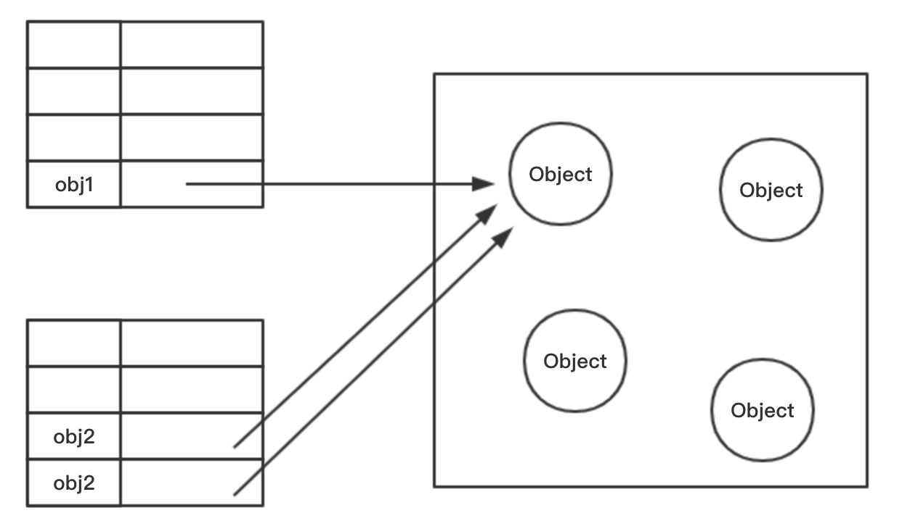

JavaScript的变量包含基本类型的值和引用类型的值。其中基本类型值是存储在栈中的一些简单的数据段；引用类型值是引用类型的实例，引用类型是一种数据结构。
JavaScript基本类型包括：String、Number、Boolean、Null、Undefined、Symbol。
JavaScript引用类型包括：Object、Array、Date、Function、RegExp等。

#### 引用类型复制
```js
  obj1 = {a: 1};
  obj2 = obj1;
  obj2.a = 2;
  console.log(obj1.a);  // 2
  console.log(obj2.a);  // 2
```
<!-- more -->
由以上示例可以看出，当改变obj2中a的值的时候，obj1中a的值也发生了同样的变化。因为引用类型变量的值实际上是一个指针，指向存储在堆内存中的对象。当把obj1的值赋给obj2时，只是复制出一个指向同一堆内存的指针，所以当通过obj2操作堆内存中的对象时，obj1取到的值也同样发生了改变。


### 浅拷贝
> 创建一个新对象，这个对象有着原始对象属性值的一份精确拷贝。如果属性是基本类型，拷贝的就是基本类型的值；如果属性是引用类型，拷贝的就是内存地址 ，所以如果其中一个对象改变了这个地址，就会影响到另一个对象。（注意：如果是赋值语句（=），将一个对象赋值给另一个对象，则无论对象中的属性是什么类型，两个对象值的改变都会相互影响。）
#### Object.assign()
ES6提供的浅拷贝方法，语法：Object.assign(target, ...soruces);
接收的第一个参数是拷贝的目标，剩下的是拷贝的源对象（可以是多个）。
```js
  obj1 = {a: 1, msg: { name: 'Amber', age: 20 }};
  obj2 = {};
  Object.assign(obj2, obj1);
  obj1.a = 2;
  obj1.msg.age = 22;
  console.log(obj1);  // { a: 2, msg: {  name: 'Amber', age: 22 }}
  console.log(obj2);  // { a: 1, msg: {  name: 'Amber', age: 22 }}
```
对于值依然是对象的元素，属于浅拷贝，改变一个对象的值，目标对象的值也会变化。
#### 扩展运算符
利用扩展运算符可以在构造字面量对象时,进行克隆或者属性拷贝，语法：cloneObj = { ...obj };
```js
  obj = {a:1,b:{c:1}}
  obj2 = {...obj};
  obj.a=2;
  console.log(obj); //{a:2,b:{c:1}}
  console.log(obj2); //{a:1,b:{c:1}}

  obj.b.c = 2;
  console.log(obj); //{a:2,b:{c:2}}
  console.log(obj2); //{a:1,b:{c:2}}
```
扩展运算符和Object.assign一样，如果一个属性的值仍然是对象的话，属于浅拷贝。
### 深拷贝
> 将一个对象从内存中完整的拷贝一份出来，从堆内存中开辟一个新的区域存放新对象，且修改新对象不会影响原对象。
#### JSON.stringify()
JSON.stringify()是目前前端开发过程中最常用的深拷贝方式，原理是把一个对象序列化成为一个JSON字符串，将对象的内容转换成字符串的形式再保存在磁盘上，再用JSON.parse()反序列化将JSON字符串变成一个新的对象。
```js 
  obj1 = {a: 1, msg: { name: 'Amber', age: 20 }};
  obj2 = JSON.parse(JSON.stringify(obj1));
  obj1.a = 2;
  obj1.msg.age = 22;
  console.log(obj1);  // { a: 2, msg: {  name: 'Amber', age: 22 }}
  console.log(obj2);  // { a: 1, msg: {  name: 'Amber', age: 20 }}
```
* 注意：深拷贝日期类型，会变成string类型；深拷贝RegExp引用类型，会变成空对象。